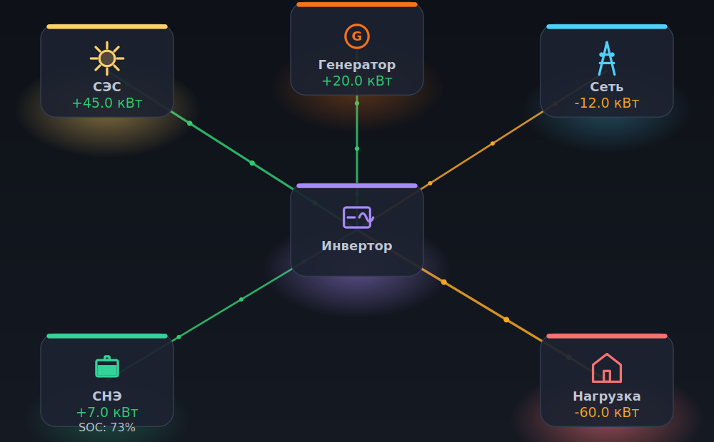
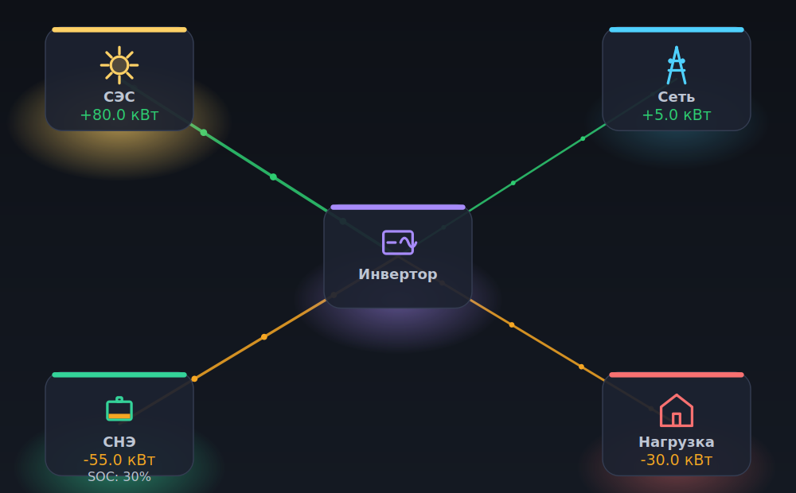

# Диспетчер гибридной энергосистемы (Deye SUN...K-PCS01HP3)

Модуль на Qt/C++ для диспетчеризации гибридной энергосистемы предприятия:
**сеть ограниченной мощности + СЭС (солнце) + СНЭ (батарея) + резервный
генератор (опционально)**, построенной на гибридном инверторе Deye
SUN...K-PCS01HP3 (PCS-модуль, Modbus RTU Protocol V105).

Модуль рассчитывает почасовой (точнее — по интервалам управления
10–60 минут) график диспетчеризации на скользящем горизонте и записывает
результат в конкретные Modbus-регистры инвертора. Предлагаются два
взаимозаменяемых метода расчёта:

1. **Эвристический (merit-order) оптимизатор** — быстрый, не требует внешних
   библиотек, работает "из коробки".
2. **MILP-оптимизатор на солвере [HiGHS](https://highs.dev)** — точный
   глобальный оптимум, требует подключения библиотеки HiGHS (см. [раздел
   "Интеграция HiGHS"](#интеграция-highs-пошаговая-инструкция)).

Оба метода реализуют один и тот же интерфейс `IDispatchOptimizer` и
взаимозаменяемы во время выполнения (выбор — чекбокс/радиокнопка в GUI).

---

## Содержание

1. [Состав проекта](#состав-проекта)
2. [Требования и сборка](#требования-и-сборка)
3. [Встраивание в существующий GUI](#встраивание-в-существующий-gui)
4. [Источник данных (SQL)](#источник-данных-sql)
5. [Скользящий горизонт и ресэмплинг](#скользящий-горизонт-и-ресэмплинг)
6. [Эвристический алгоритм (merit-order)](#эвристический-алгоритм-merit-order)
7. [MILP-модель (HiGHS)](#milp-модель-highs)
8. [Интеграция HiGHS — пошаговая инструкция](#интеграция-highs-пошаговая-инструкция)
9. [Отображение на регистры инвертора](#отображение-на-регистры-инвертора)
10. [Мнемосхема энергосистемы (EnergyMimicWidget)](#мнемосхема-энергосистемы-energymimicwidget)
11. [Важные предупреждения перед вводом в эксплуатацию](#важные-предупреждения-перед-вводом-в-эксплуатацию)

---

## Состав проекта

```
include/dispatcher/
    SystemConfig.h            — параметры системы (задаются пользователем/проектом)
    DispatchPermissions.h     — 4 бинарных разрешения пользователя (m_genEnable и т.д.)
    ForecastTypes.h           — входные данные прогноза (почасовые/получасовые)
    DispatchTypes.h           — результат диспетчеризации (DispatchPlan/DispatchInterval)
    IDispatchOptimizer.h      — общий интерфейс двух методов оптимизации
    HeuristicDispatchOptimizer.h
    MilpDispatchOptimizer.h
    InverterRegisterMap.h     — карта регистров Modbus (адреса, маски, масштабы)
    InverterCommandMapper.h   — DispatchInterval -> регистры инвертора
    ModbusInverterClient.h    — асинхронная обёртка над QModbusClient
    ForecastRepository.h      — загрузка прогноза из SQL, ресэмплинг на период управления
    DispatchEngine.h          — QObject-контроллер скользящего горизонта (главная точка встраивания)
src/
    *.cpp                     — реализации перечисленных выше классов
gui/
    DispatcherPanel.h/.cpp     — готовый встраиваемый QWidget поверх DispatchEngine
    EnergyMimicWidget.h/.cpp   — анимированная мнемосхема энергосистемы (см. раздел 10),
                                 самостоятельный виджет без зависимости от DispatchEngine
examples/
    integration_example.cpp   — минимальный пример встраивания панели в QMainWindow
    mimic_widget_example.cpp  — минимальный пример использования мнемосхемы (см. раздел 10)
cmake/
    FindOrFetchHiGHS.cmake    — подключение HiGHS (см. раздел 8)
docs/img/
    mimic_widget_*.png        — скриншоты мнемосхемы для README (раздел 10)
CMakeLists.txt
```

Слой без Qt-GUI-зависимостей (`include/dispatcher` + `src`, собирается в
статическую библиотеку `dispatcher_core`, зависит только от Qt Core/Sql/
SerialBus) можно использовать и без графического интерфейса — например, в
headless-сервисе. Виджет `DispatcherPanel` (библиотека `dispatcher_gui`,
зависит от Qt Widgets) — это готовый, но необязательный слой поверх него.

---

## Требования и сборка

- Qt 5.15+ или Qt 6.x, модули **Core, Sql, SerialBus** (+ **Widgets**, если
  нужен `DispatcherPanel`). Модуль `SerialBus` в Qt устанавливается отдельно
  (`Qt SerialBus` в онлайн-инсталляторе, либо пакеты `libqt6serialbus6-dev` /
  `libqt5serialbus5-dev` в дистрибутивах Linux).
- Компилятор с поддержкой C++17.
- CMake 3.16+.
- HiGHS — **опционально**, только для MILP-метода (см. раздел 8). Без него
  проект прекрасно собирается и работает, MILP-метод просто на этапе
  выполнения делегирует расчёт эвристике с предупреждением в лог.

Базовая сборка (только эвристика, без HiGHS):

```bash
cmake -B build -S . -DCMAKE_BUILD_TYPE=Release
cmake --build build -j
```

Сборка с MILP-солвером:

```bash
cmake -B build -S . -DCMAKE_BUILD_TYPE=Release -DENABLE_HIGHS=ON
cmake --build build -j
```

Запуск демонстрационного примера (см. `examples/integration_example.cpp`):

```bash
./build/dispatcher_example
```

---

## Встраивание в существующий GUI

Есть два уровня встраивания — выберите тот, что удобнее для вашей архитектуры.

### Вариант А (быстрый): готовый виджет `DispatcherPanel`

```cpp
#include "DispatcherPanel.h"
#include "dispatcher/ModbusInverterClient.h"

// ... внутри конструктора существующего QMainWindow/виджета:
auto *panel = new DispatcherPanel(this);

SystemConfig config;
config.gridMaxImportKw = 200.0;
config.batteryCapacityKwh = 500.0;
// ... остальные поля SystemConfig - под конкретный объект
panel->engine()->setSystemConfig(config);

// Прогноз читается из уже открытого QSqlDatabase-соединения (имя соединения,
// не сам объект - см. раздел "Источник данных"):
panel->engine()->setForecastConnectionName("main_db");

// Modbus - опционально; без него DispatchEngine работает в режиме симуляции.
auto *modbus = new ModbusInverterClient(this);
modbus->configureSerial("/dev/ttyUSB0", 9600);
modbus->setServerAddress(1);
modbus->connectDevice();
panel->engine()->setModbusClient(modbus);

ui->tabWidget->addTab(panel, tr("Диспетчер энергии"));
```

Панель сама показывает таблицу плана, чекбоксы разрешений
(`m_genEnable`/`m_genChargeEnable`/`m_sollSell`/`m_sollSellOfBatteries`),
выбор метода (эвристика/MILP), период оптимизации (10–60 мин, спинбокс) и
кнопки Старт/Стоп/"Пересчитать сейчас".

### Вариант Б (гибкий): напрямую через `DispatchEngine`

Если в проекте уже есть свои виджеты для настроек и таблиц, используйте
`DispatchEngine` напрямую и подключите его сигналы (`planReady`,
`statusMessage`, `errorOccurred`, `cycleStarted`/`cycleFinished`) к своим
слотам — см. `gui/DispatcherPanel.cpp` как образец такого подключения.

---

## Источник данных (SQL)

`ForecastRepository` ожидает две таблицы (имена/столбцы настраиваются через
`ForecastSchema`, если в БД предприятия они называются иначе):

```sql
CREATE TABLE forecast_hourly (
    timestamp  TIMESTAMP PRIMARY KEY,  -- начало часа, ISO 8601
    buy_price  DOUBLE PRECISION,       -- цена покупки из сети, руб/кВт*ч
    sell_price DOUBLE PRECISION,       -- цена продажи излишков солнца в сеть, руб/кВт*ч
    solar_kw   DOUBLE PRECISION,       -- прогноз мощности СЭС, кВт
    load_kw    DOUBLE PRECISION        -- прогноз нагрузки предприятия, кВт
);
-- обновляется раз в сутки в 13:00 на следующие сутки (см. ТЗ)

CREATE TABLE grid_availability_forecast (
    timestamp TIMESTAMP PRIMARY KEY,   -- начало получаса
    grid_on   BOOLEAN                  -- 1 - сеть доступна, 0 - плановое отключение
);
```

`ForecastRepository` использует уже открытое приложением `QSqlDatabase`-
соединение (по имени, см. `QSqlDatabase::database(name)`) — модуль
намеренно не открывает и не настраивает соединение сам, чтобы не
конфликтовать с уже существующим управлением подключением к БД в хост-
приложении.

---

## Скользящий горизонт и ресэмплинг

`DispatchEngine` пересчитывает график **заново на каждом шаге** (каждые
`controlPeriodMinutes`, 10–60 минут — настраивается пользователем), каждый
раз:

1. читая **текущий** измеренный SOC инвертора (регистр 3088) и напряжение
   СНЭ (регистр 3015);
2. загружая **свежий** прогноз горизонта из БД (цены обновляются раз в сутки
   в 13:00, поэтому "свежесть" здесь — это, как правило, всё те же дневные
   значения, но горизонт каждый раз сдвигается на текущее время);
3. вызывая выбранный оптимизатор с этими двумя входами;
4. записывая в инвертор только **первый** интервал получившегося плана —
   остаток плана используется исключительно для того, чтобы первый интервал
   был выбран с учётом будущего (например, ценового арбитража, см. шаг 7
   эвристики), а не "жадно" без заглядывания вперёд.

Такая схема (пересчёт всего горизонта на каждом шаге, применение только
первого шага результата) называется **rolling horizon control** и делает
диспетчеризацию устойчивой к неточности прогноза: каждая новая ошибка
прогноза исправляется уже на следующем шаге, а не накапливается.

Почасовые/получасовые входные данные **ресэмплируются ступенчато** на
интервалы управления: если период управления, например, 15 минут, то все
четыре 15-минутных под-интервала одного часа получают одно и то же
`buyPrice`/`sellPrice`/`solarKw`/`loadKw` (интерполяция не делается
намеренно — она создала бы ложную точность там, где её физически нет:
прогноз солнца/нагрузки строится на часовом шаге).

---

## Эвристический алгоритм (merit-order)

Реализован в `HeuristicDispatchOptimizer`. Работает на всём горизонте,
интервал за интервалом, в хронологическом порядке, применяя на каждом шаге
следующие 7 приоритетов (шаг 7 фактически спланирован *заранее*, как
предварительный проход по всему горизонту — см. ниже):

### Классификация часов по цене (для шагов 3 и 7)

Пусть `B = {buyPrice_i}` — цены покупки всех интервалов горизонта. Пороги:

```
priceCheap      = percentile(B, cheapPricePercentile)       // напр. 30-й перцентиль
priceExpensive  = percentile(B, expensivePricePercentile)   // напр. 70-й перцентиль
```

Интервал `i` считается **дешёвым**, если `buyPrice_i <= priceCheap`,
**дорогим** — если `buyPrice_i >= priceExpensive`, иначе — обычным.
Перцентиль вычисляется линейной интерполяцией (как `numpy.percentile` по
умолчанию).

### Стоимость цикла СНЭ

Один "полный цикл" батареи = заряд на всю ёмкость + разряд на всю ёмкость,
то есть `2 * batteryCapacityKwh` кВт·ч суммарного энергопотока. Отсюда
деградационная стоимость одного кВт·ч потока (заряда ИЛИ разряда):

```
degradationCostPerKwh = cycleCostPerFullCycle / (2 * batteryCapacityKwh)
```

Эта величина используется во всех проверках "выгодно ли использовать
батарею" — и в эвристике, и в MILP (единая формула — `SystemConfig::
degradationCostPerKwh()`).

### Шаг 1 — солнце → нагрузка

```
solarToLoad_i = min(solarKw_i, loadKw_i)
```

### Шаг 2 — излишки солнца → СНЭ, остаток → продажа в сеть

```
surplus = solarKw_i - solarToLoad_i
solarToBattery_i = min(surplus, batteryMaxChargeKw, (socMax*C - SOC) / (chargeEff * dt))
solarToGrid_i    = min(surplus - solarToBattery_i, gridMaxExportKw)     [если m_sollSell и сеть доступна]
solarCurtailed_i = остаток (излишки, которые некуда деть)
```
где `C = batteryCapacityKwh`, `dt` — длительность интервала в часах.

### Шаг 7 (планируется заранее) — ценовой арбитраж

Перед хронологическим циклом строится **заявка** на заряд от сети в дешёвые
часы, если это окупается продажей/экономией в дорогие часы горизонта.
Прибыль на 1 кВт·ч энергии `E`, взятой из сети в дешёвый час `c` для
использования в дорогой час `e > c`:

```
profitPerKwh(c, e) = chargeEff * dischargeEff * buyPrice_e
                      - buyPrice_c
                      - degradationCostPerKwh * (1 + chargeEff * dischargeEff)
```

Первое слагаемое — экономия на покупке в дорогой час (с учётом двойного
КПД — из `E` кВт·ч, взятых из сети, до потребителя дойдёт только
`E * chargeEff * dischargeEff`). Второе — стоимость самой покупки в дешёвый
час. Третье — деградационная стоимость обеих операций (заряда `E` и
последующего разряда `E * chargeEff * dischargeEff`).

Алгоритм жадно перебирает дешёвые часы по возрастанию цены, для каждого —
дорогие часы (позже по времени) по убыванию цены, и накапливает заряд от
сети, пока `profitPerKwh > 0` и не исчерпаны мощность заряда/разряда и
эксплуатационный диапазон SOC. Как только очередная пара становится
невыгодной — дальнейший перебор для этого дешёвого часа прекращается (цены
отсортированы, значит выгода дальше только меньше).

Полученная заявка накладывается на заряд от солнца (шаг 2) в хронологическом
цикле — как отдельная добавка `gridToBattery_i`, с реальными на тот момент
ограничениями по мощности и SOC (заявка — это верхняя оценка, а не жёсткая
команда: см. код `HeuristicDispatchOptimizer::planPriceArbitrage`).

### Шаг 3 — разряд СНЭ в дорогие часы

Если после шагов 1-2 остался непокрытый спрос (`remLoad > 0`) и час
классифицирован как дорогой:

```
benefitPerKwh = buyPrice_i - degradationCostPerKwh / dischargeEff
если benefitPerKwh > 0:
    batteryToLoad_i = min(remLoad, batteryMaxDischargeKw,
                           (SOC - (socMin+socReserve)*C) * dischargeEff / dt)
```

Продажа разряда СНЭ в сеть (если `m_sollSell && m_sollSellOfBatteries`)
считается аналогично, но с `sellPrice_i` вместо `buyPrice_i` и с учётом
оставшегося лимита экспорта.

### Шаг 4 — покупка из сети

```
gridToLoad_i = min(remLoad, gridMaxImportKw - gridToBattery_i)   [если сеть доступна]
```
(лимит импорта уменьшен на уже использованный на этот же интервал
арбитражный заряд от сети, шаг 7).

### Шаг 5 — аварийный доразряд СНЭ

Если после шага 4 всё ещё есть непокрытый спрос (лимит сети исчерпан или
сеть недоступна), СНЭ **дополнительно** разряжается вниз до `socMin` (а не
только до `socMin+socReserve`, как на шаге 3) — это единственный шаг, где
эксплуатационный резерв `socReserve` расходуется:

```
extra_i = min(remLoad, batteryMaxDischargeKw - уже использованное,
              (SOC - socMin*C) * dischargeEff / dt)
```

### Шаг 6 — резервный генератор

Если после шага 5 остался непокрытый спрос и `m_genEnable`:

```
genToLoad_i = min(remLoad, genMaxPowerKw)
```

Если генератор запущен и `m_genChargeEnable`, свободный остаток мощности
генератора (`genMaxPowerKw - genToLoad_i`) может дополнительно зарядить СНЭ
в пределах мощности заряда и SOC-потолка.

### Итоговые величины интервала

```
batteryNetPowerKw = (solarToBattery + gridToBattery + genToBattery) - (batteryToLoad + batteryToGrid)
gridNetPowerKw    = (solarToGrid + batteryToGrid) - (gridToLoad + gridToBattery)
genPowerKw        = genToLoad + genToBattery
```
(знаки — см. `DispatchTypes.h`: `+` СНЭ = заряд, `+` сеть = экспорт).

---

## MILP-модель (HiGHS)

Реализована в `MilpDispatchOptimizer`. В отличие от эвристики, которая
применяет приоритеты последовательно, MILP находит **глобально оптимальный**
график сразу для всего горизонта, разыгрывая тот же набор степеней свободы
как задачу линейного программирования с двумя бинарными переменными на
интервал.

### Переменные (на каждый интервал `i`, длительность `dt_i`)

| Переменная | Смысл | Границы |
|---|---|---|
| `fSolarLoad_i` | солнце → нагрузка | `[0, solarKw_i]` |
| `fSolarBatt_i` | солнце → СНЭ | `[0, solarKw_i]` |
| `fSolarGrid_i` | солнце → сеть (продажа) | `[0, solarKw_i]` |
| `fSolarCurtail_i` | скошенное солнце | `[0, solarKw_i]` |
| `fGridLoad_i` | сеть → нагрузка | `[0, gridMaxImportKw]` (0, если сеть недоступна) |
| `fGridBatt_i` | сеть → СНЭ (арбитраж) | `[0, gridMaxImportKw]` |
| `fGenLoad_i` | генератор → нагрузка | `[0, genMaxPowerKw]` (0, если `!m_genEnable`) |
| `fGenBatt_i` | генератор → СНЭ | `[0, genMaxPowerKw]` (0, если `!m_genChargeEnable`) |
| `fBattLoad_i` | СНЭ → нагрузка | `[0, batteryMaxDischargeKw]` |
| `fBattGrid_i` | СНЭ → сеть (продажа) | `[0, batteryMaxDischargeKw]` (0, если запрещено) |
| `pUnserved_i` | недоотпуск нагрузки ("предохранитель") | `[0, loadKw_i]` |
| `soc_i` | SOC на конец интервала, кВт·ч | `[(socMin[+socReserve])*C, socMax*C]` |
| `bChg_i` | бинарный признак "СНЭ заряжается" | `{0,1}` |
| `bDis_i` | бинарный признак "СНЭ разряжается" | `{0,1}` |

### Ограничения

```
(R1) fSolarLoad_i + fSolarBatt_i + fSolarGrid_i + fSolarCurtail_i = solarKw_i
(R2) fSolarLoad_i + fGridLoad_i + fGenLoad_i + fBattLoad_i + pUnserved_i = loadKw_i
(R3) fGridLoad_i + fGridBatt_i <= gridMaxImportKw            [0, если сеть недоступна]
(R4) fSolarGrid_i + fBattGrid_i <= gridMaxExportKw           [0, если !m_sollSell или сеть недоступна]
(R5) fGenLoad_i + fGenBatt_i <= genMaxPowerKw                [0, если !m_genEnable]
(R6) fSolarBatt_i + fGridBatt_i + fGenBatt_i <= batteryMaxChargeKw * bChg_i
(R7) fBattLoad_i + fBattGrid_i <= batteryMaxDischargeKw * bDis_i
(R8) bChg_i + bDis_i <= 1                                    (не заряжать и разряжать одновременно)
(R9) soc_i = soc_{i-1} + dt_i*chargeEff*(fSolarBatt_i+fGridBatt_i+fGenBatt_i)
                       - (dt_i/dischargeEff)*(fBattLoad_i+fBattGrid_i)
     soc_{-1} := SOC_измеренный (текущий, из регистра 3088)
```

Права пользователя (`m_genEnable`, `m_genChargeEnable`, `m_sollSell`,
`m_sollSellOfBatteries`) реализованы как **верхние границы соответствующих
переменных = 0**, а не как отдельные ограничения — солвер сам находит
оптимум с учётом того, что эти степени свободы попросту недоступны.

### Целевая функция (минимизация суммарных затрат горизонта)

```
min  Σ_i  dt_i * [ buyPrice_i*(fGridLoad_i+fGridBatt_i)
                    - sellPrice_i*(fSolarGrid_i+fBattGrid_i)
                    + genCostPerKwh*(fGenLoad_i+fGenBatt_i) ]
   + Σ_i  degradationCostPerKwh * [ (fSolarBatt_i+fGridBatt_i+fGenBatt_i)
                                     + (fBattLoad_i+fBattGrid_i) ] * dt_i
   + Σ_i  dt_i * lossOfLoadPenaltyPerKwh * pUnserved_i
```

`pUnserved` и его штраф (`SystemConfig::lossOfLoadPenaltyPerKwh`, заведомо
намного больше любой реальной цены) существуют только для того, чтобы модель
**всегда оставалась разрешимой** даже в вырожденных случаях (сеть
недоступна, генератор запрещён, СНЭ разряжена до предела) — в нормальных
условиях эта переменная равна нулю в оптимальном решении.

### Резервный SOC и релаксация

Как и в эвристике, у SOC есть "мягкий" нижний предел
`socMin+socReserve` и "аварийный" `socMin`. MILP сначала решает задачу с
мягким пределом (жёсткая граница переменной `soc_i`, без штрафа). Расчёт
**автоматически** повторяется с аварийным пределом `socMin`, если:

- решения с мягким пределом не существует вовсе (солвер возвращает
  infeasible), **или**
- решение существует, но в нём `pUnserved_i > 0` хотя бы для одного
  интервала — т.е. модель предпочла заплатить штраф за недоотпуск нагрузки,
  а не тронуть резерв, потому что на первом проходе резерв — это жёсткая
  граница, а не вариант с ценой. Без этой проверки MILP никогда бы не
  пришёл к выводу "лучше распечатать резерв, чем недоотпустить нагрузку",
  и всегда бы выбирал недоотпуск даже тогда, когда резерв мог бы его
  полностью покрыть.

Это MILP-аналог шага 5 эвристики (аварийный доразряд), только здесь решение
о том, когда именно расходовать резерв, принимается солвером глобально, а
не локальным правилом.

### Почему нужен MILP, а не просто LP

Формально при выпуклых потерях (КПД < 100%) одновременный заряд и разряд
никогда не выгоден сам по себе, поэтому для *этой конкретной* модели LP-
релаксация почти всегда даёт тот же результат, что и MILP. Бинарные
переменные `bChg`/`bDis` добавлены как явная гарантия (а не как оптимизация
"на всякий случай") и как основа для будущего расширения модели
переменными, для которых выпуклость уже не спасает (например,
времязависимая минимальная мощность генератора, деление горизонта на
крупные блоки работы генератора, штраф за старт/остановку и т.п.) — это же
демонстрирует использование HiGHS именно как MILP-, а не только LP-солвера,
как и требовалось по ТЗ.

---

## Интеграция HiGHS — пошаговая инструкция

MILP-метод компилируется всегда, но реальный солвер подключается только при
сборке с `-DENABLE_HIGHS=ON`. Без этого флага `MilpDispatchOptimizer`
существует, но на этапе выполнения выводит предупреждение в лог и
делегирует расчёт эвристике — так GUI можно разрабатывать и тестировать, не
устанавливая HiGHS, а подключить его позже без единой правки в остальном
коде.

### Шаг 1. Выберите способ получения HiGHS

Файл `cmake/FindOrFetchHiGHS.cmake` уже реализует автоматический выбор:
сначала пробует найти установленный HiGHS через `find_package`, и только
если не находит — собирает его из исходников через `FetchContent`. Ниже —
детали для каждого варианта, если хочется управлять этим вручную.

**Вариант A — системный пакет / vcpkg / conan (рекомендуется для CI и
продакшена, т.к. не требует пересборки HiGHS при каждой чистой сборке
проекта):**

```bash
# vcpkg
vcpkg install highs

# conan
conan install --requires=highs/1.7.2

# Debian/Ubuntu (если пакет есть в репозитории дистрибутива - проверьте версию)
sudo apt install libhighs-dev
```

После установки любым из этих способов передайте CMake путь к toolchain-файлу
(для vcpkg) или просто убедитесь, что `HiGHSConfig.cmake` виден через
`CMAKE_PREFIX_PATH`:

```bash
cmake -B build -S . -DENABLE_HIGHS=ON \
      -DCMAKE_TOOLCHAIN_FILE=/path/to/vcpkg/scripts/buildsystems/vcpkg.cmake
```

**Вариант B — сборка из исходников через FetchContent (используется
автоматически, если HiGHS не найден системно; ничего дополнительно
настраивать не нужно):**

```bash
cmake -B build -S . -DENABLE_HIGHS=ON
cmake --build build -j
```

При первой сборке CMake скачает исходники HiGHS (тег `v1.7.2`, см.
`cmake/FindOrFetchHiGHS.cmake` — при необходимости замените на нужную вам
версию) и соберёт их как подпроект. Это увеличивает время первой сборки на
несколько минут (компиляция HiGHS), но не требует ручных действий и не
зависит от того, что установлено в системе.

### Шаг 2. Проверьте, что нужные системные зависимости для сборки HiGHS есть

HiGHS сам по себе написан на C++ (без обязательной Fortran-части в
современных версиях), но для сборки нужны:

- компилятор C++17;
- CMake 3.16+;
- (опционально, но желательно) `pkg-config` — некоторые версии HiGHS
  используют его для поиска zlib при включённой поддержке сжатых MPS-файлов;
  для нашей интеграции (чистое использование C++ API, без загрузки файлов
  моделей) эта возможность не нужна и не влияет на сборку.

Если сборка HiGHS падает с ошибками, связанными с Fortran (`enable_language
Fortran` и т.п.) — убедитесь, что используете тег `v1.7.x` и выше (более
старые версии HiGHS требовали Fortran для некоторых компонентов, которые нам
не нужны).

### Шаг 3. Подключите библиотеку к своему коду

Если вы используете этот репозиторий как поддиректорию/подмодуль своего
проекта — просто включите `ENABLE_HIGHS`, всё остальное `CMakeLists.txt`
делает автоматически (`target_link_libraries(dispatcher_core PUBLIC
highs::highs)`, макрос `ENABLE_HIGHS` определяется для всех потребителей
`dispatcher_core`).

Если вы переносите файлы `MilpDispatchOptimizer.*` в **другую** систему
сборки (не CMake из этого репозитория), добавьте вручную:

```cmake
find_package(HiGHS CONFIG REQUIRED)
target_link_libraries(your_target PRIVATE highs::highs)
target_compile_definitions(your_target PRIVATE ENABLE_HIGHS)
```

или, если сборка не через CMake (qmake/Makefile вручную), добавьте:

- путь до заголовков HiGHS (обычно `<prefix>/include/highs`, файл
  `Highs.h`) во `include path`;
- флаг компилятора `-DENABLE_HIGHS`;
- линковку с `libhighs` (`-lhighs` или `highs.lib`).

### Шаг 4. Проверьте, что HiGHS реально подключился

```cpp
#include "dispatcher/MilpDispatchOptimizer.h"
// ...
qDebug() << "HiGHS доступен:" << MilpDispatchOptimizer::isHighsAvailable();
```

Если возвращает `false` при собранном с `-DENABLE_HIGHS=ON` проекте —
проверьте, что макрос `ENABLE_HIGHS` действительно долетает до компиляции
`src/MilpDispatchOptimizer.cpp` (например, чистая пересборка после смены
опции CMake: `cmake --build build --target clean && cmake --build build`).

### Типичные проблемы и решения

| Симптом | Причина | Решение |
|---|---|---|
| `HiGHS_FOUND` не находится, хотя пакет установлен | `HiGHSConfig.cmake` не в `CMAKE_PREFIX_PATH` | Передайте `-DCMAKE_PREFIX_PATH=/путь/к/установке/HiGHS` |
| Ошибки компиляции `Highs.h: No such file` | Заголовки лежат в `<prefix>/include/highs/Highs.h`, а не `<prefix>/include/Highs.h` | Добавьте `#include <highs/Highs.h>` вместо `#include <Highs.h>`, либо (наш вариант) полагайтесь на `target_link_libraries(... highs::highs)`, который сам прописывает нужный include-путь |
| Долгая первая сборка (5-10 минут) | Сборка HiGHS из исходников через FetchContent | Ожидаемо один раз; используйте Вариант A (системный пакет) для CI, если это критично |
| MILP возвращает пустой план с предупреждением "MILP не решена" | Модель infeasible даже после релаксации SOC до `socMin` (физически невозможно покрыть нагрузку) | Проверьте настройки разрешений (`m_genEnable` и т.п.) и лимиты `gridMaxImportKw`/`genMaxPowerKw` относительно `loadKw` горизонта |

---

## Отображение на регистры инвертора

`InverterCommandMapper::buildCommandSet()` конвертирует **первый интервал**
только что рассчитанного плана в набор записей регистров (см.
`InverterRegisterMap.h` — там же ссылки на страницы протокола). Из
нескольких перекрывающихся по смыслу регистров осознанно выбраны те, что
оперируют **физическими** единицами (А, кВт), а не процентами от
неизвестной диспетчеру номинальной мощности PCS — это позволяет обойтись
без чтения/хранения паспортной мощности инвертора:

| Регистр(ы) | Назначение | Как считается диспетчером |
|---|---|---|
| 2040 (Maximum Discharge Current) | ток разряда СНЭ, 0.1 А | `min(|P_discharge|*1000/U_batt, 175.0 А)` |
| 2041 (Maximum Charge Current) | ток заряда СНЭ, 0.1 А, знаковый | `-min(P_charge*1000/U_batt, 175.0 А)` |
| 2044/2045 (Max Discharge/Charge Power, %) | статически 120.0% ("широко открыто") | не ограничивает — токовые пределы выше первичны |
| 2046/2047 (SOC max/min) | границы SOC, 0.1% | `socMax`, `socFloorUsedFrac` (обычный резерв либо аварийный `socMin`) |
| 2065 (Battery Charge Setting, битовое поле) | Grid Charge/Gen Charge/Gen Signal/Battery First | см. ниже |
| 2100 (Export Limit Function, битовое поле) | Solar Sell | `m_sollSell` |
| 2103 (Max sell Power) / 2104 (Peak shaving Power) | целевая мощность обмена с сетью, 0.1 кВт, знаковая | оба = `gridNetPowerKw` плана (± = экспорт/импорт) |

`U_batt` — живое измеренное напряжение СНЭ (регистр 3015), читается перед
каждым циклом расчёта вместе с SOC (регистр 3088).

Регистры 2065 и 2100 упаковывают **несколько независимых настроек в одном
16-битном слове**, поэтому запись в них всегда выполняется как
**read-modify-write** (`ModbusInverterClient::doReadModifyWriteBitfield`):
читается текущее значение, заменяются только нужные биты, остальное
сохраняется без изменений. Это принципиально — иначе диспетчер мог бы
незаметно затереть настройки защиты от перетока (ZeroExport/HardLimit),
которые в его зону ответственности не входят.

**Битовые поля, которые пишет диспетчер:**

- Регистр 2065, биты 0-1 (Grid Charge Enabled) = 1, если план требует заряда
  от сети в этом интервале (`gridChargeUsed`), иначе 0.
- Регистр 2065, биты 2-3 (Gen Charge Enabled) = зеркалирует
  `m_genChargeEnable` напрямую (это разрешение уровня устройства, а не
  команда конкретного интервала).
- Регистр 2065, биты 6-7 (Gen Signal) = 1, если план требует запуска
  генератора в этом интервале (`genRunning`).
- Регистр 2065, биты 8-9 (Battery First) = всегда 1 — политика диспетчера:
  излишки солнца сначала идут на заряд СНЭ, потом на продажу (согласовано с
  шагом 2 эвристики и структурой MILP-модели).
- Регистр 2100, биты 6-7 (Solar Sell) = зеркалирует `m_sollSell`.

Регистры автозапуска генератора по SOC (2106/2107) и параметры генератора
(2119-2121) диспетчер **не трогает** — генератор управляется напрямую битом
Gen Signal каждый цикл, исходя уже посчитанного плана (который сам учитывает
SOC через шаги 5-6 эвристики/ограничения MILP).

---

## Мнемосхема энергосистемы (EnergyMimicWidget)

`EnergyMimicWidget` (`gui/EnergyMimicWidget.h/.cpp`) — интерактивная
анимированная мнемосхема энергосистемы предприятия: шесть карточек-узлов
(Сеть, СЭС, СНЭ, Инвертор, резервный Генератор, Нагрузка) вокруг центрального
инвертора, соединённые анимированными линиями, показывающими направление и
интенсивность перетоков энергии.

В отличие от `DispatcherPanel`, виджет **не зависит от `DispatchEngine`** и не
содержит логики расчёта — это чисто отображающий компонент. Он не создаёт
собственных таймеров опроса устройства и не имеет предположений об источнике
данных: вы вызываете его `setXxx()`-слоты откуда угодно (сигнал
`DispatchEngine::planReady`, отдельный опрос Modbus, любой ваш сервис
телеметрии). Единственный внутренний `QTimer` виджета отвечает только за
анимацию "бегущих" точек на линиях связи (~30 кадров/сек) и не связан с
частотой поступления новых данных.

Скриншоты ниже — реальные кадры виджета (получены из `examples/mimic_widget_example.cpp`,
см. `docs/img/`):

**Генератор в составе, СНЭ слегка разряжается** (СЭС/сеть/генератор отдают
мощность — зелёным, нагрузка потребляет — оранжевым):



**Генератор отсутствует в составе (`m_genVisible = false`), избыток солнца заряжает СНЭ**
(узел и связь генератора не отображаются, у СНЭ и SOC — низкий заряд 30%):



### Как выглядит раскладка

```
        [СЭС]        [Генератор]*         [Сеть]
           \               |                /
            \              |               /
             '-------- [ИНВЕРТОР] --------'
            /                               \
           /                                 \
     [СНЭ, SOC%]                         [Нагрузка]

  * узел и его связь полностью скрываются, если m_genVisible == false
```

Раскладка фиксированная (не "переливается" при скрытии генератора) —
намеренное решение, чтобы элементы мнемосхемы не "прыгали" по экрану при
переключении состава системы, а оператор всегда находил нужный узел на
привычном месте.

### Входные данные и конвенция знака мощности

Виджет хранит текущее состояние системы в шести внутренних переменных —
именно с такими именами и назначением, как зафиксировано в задании на виджет:

| Переменная    | Тип    | Смысл                                                             |
|---------------|--------|--------------------------------------------------------------------|
| `m_sollarPow` | double | Мощность СЭС, кВт, **≥ 0** (панели не потребляют энергию)          |
| `m_gridPov`   | double | Мощность обмена с сетью, кВт: **> 0 — импорт** (сеть → инвертор), **< 0 — экспорт** (инвертор → сеть) |
| `m_loadPow`   | double | Мощность нагрузки, кВт, **≥ 0** (хранится как модуль потребления)  |
| `m_genVisible`| bool   | Есть ли резервный генератор в составе системы данного объекта      |
| `m_genPow`    | double | Мощность генератора, кВт, **≥ 0**, учитывается только если `m_genVisible == true` |
| `m_soc`       | double | Заряд СНЭ, %, диапазон 0..100 (это НЕ мощность)                    |

Единая конвенция знака для двунаправленных потоков (Сеть, СНЭ): **`> 0` —
энергия течёт ОТ элемента К ИНВЕРТОРУ** (элемент отдаёт мощность), **`< 0` —
энергия течёт ОТ ИНВЕРТОРА К элементу** (элемент потребляет мощность). СЭС и
генератор физически могут только отдавать, поэтому их значения всегда `≥ 0`.
Нагрузка физически может только потреблять, поэтому хранится как модуль, а
направление связи для неё жёстко закреплено как "инвертор → нагрузка".

**Важно:** отдельной входной переменной для мощности СНЭ (заряд/разряд) в
задании не предусмотрено — есть только `m_soc`. Поэтому виджет вычисляет
мгновенный поток мощности СНЭ сам, из баланса мощности на шинах инвертора
(см. `EnergyMimicWidget::batteryFlowKw()` в .cpp):

```
приток (без СНЭ)  = m_sollarPow + (m_genVisible ? m_genPow : 0) + max(m_gridPov, 0)
отток  (без СНЭ)  = m_loadPow + max(-m_gridPov, 0)
поток СНЭ         = отток − приток
                    > 0 → разряд (СНЭ отдаёт разницу в инвертор)
                    < 0 → заряд  (избыток источников идёт в СНЭ)
```

Если в вашем проекте есть отдельный Modbus-регистр фактической измеренной
мощности СНЭ и вы не хотите полагаться на расчётный баланс — замените вызов
`batteryFlowKw()` в `paintEvent()`/`drawNodeCard()` на своё значение (весь код,
который нужно поменять, сосредоточен в одном месте — самой функции
`batteryFlowKw()`).

### API виджета

```cpp
#include "EnergyMimicWidget.h"

auto *mimic = new EnergyMimicWidget(parentWidget);

// Обновление по одному параметру:
mimic->setSolarPowerKw(45.0);
mimic->setGridPowerKw(-12.0);       // отрицательное значение = экспорт в сеть
mimic->setLoadPowerKw(60.0);
mimic->setGeneratorVisible(true);   // управляется пользовательской настройкой проекта
mimic->setGeneratorPowerKw(20.0);
mimic->setBatterySocPercent(73.0);

// Или одним атомарным вызовом (без промежуточных перерисовок):
mimic->setSystemState(/*solarPowerKw=*/45.0, /*gridPowerKw=*/-12.0,
                       /*loadPowerKw=*/60.0, /*generatorVisible=*/true,
                       /*generatorPowerKw=*/20.0, /*batterySocPercent=*/73.0);

// Опционально: опорная мощность для нормировки скорости анимации и яркости
// подсветки узлов (по умолчанию 100 кВт - подберите под номинал вашей системы).
mimic->setReferencePowerKw(200.0);
```

### Встраивание виджета в существующий GUI

Виджет — обычный `QWidget`, поэтому встраивается стандартно, например как
вкладка рядом с `DispatcherPanel`:

```cpp
auto *mimic = new EnergyMimicWidget(this);
ui->tabWidget->addTab(mimic, tr("Мнемосхема"));
```

Если у вас уже работает `DispatchEngine`, самый простой способ подать данные —
подписаться на `planReady` и пересчитать первый интервал плана в вызов
`setSystemState()` (полный рабочий пример — `examples/mimic_widget_example.cpp`,
закомментированный блок "Вариант Б"):

```cpp
connect(engine, &DispatchEngine::planReady, mimic, [mimic](DispatchPlan plan) {
    if (plan.isEmpty())
        return;
    const DispatchInterval &first = plan.constFirst();

    // СЭС: суммарная выработка независимо от того, куда она была направлена.
    const double solarKw = first.solarToLoadKw + first.solarToBatteryKw
                          + first.solarToGridKw + first.solarCurtailedKw;

    // Нагрузка: суммарно покрыта из всех источников.
    const double loadKw = first.solarToLoadKw + first.batteryToLoadKw
                         + first.gridToLoadKw + first.genToLoadKw;

    // ВАЖНО: знак gridNetPowerKw в DispatchInterval (+ экспорт/− импорт)
    // ПРОТИВОПОЛОЖЕН конвенции виджета (+ импорт/− экспорт) - инвертируем.
    const double gridKw = -first.gridNetPowerKw;

    // Мощность СНЭ передавать не нужно - виджет считает её сам из баланса,
    // достаточно передать SOC.
    mimic->setSystemState(solarKw, gridKw, loadKw, /*generatorVisible=*/true,
                           first.genPowerKw, first.socEndFrac * 100.0);
});
```

Если `DispatchEngine` в проекте не используется (например, мнемосхема нужна
как самостоятельный экран телеметрии) — просто вызывайте `setXxx()`/
`setSystemState()` из своего кода опроса инвертора, откуда угодно.

### Замена иконок узлов

У каждого узла есть иконка, условно изображающая его назначение (стилизованная
опора ЛЭП для Сети, солнце для СЭС, батарея с уровнем заряда для СНЭ, блок с
символами DC/AC для Инвертора, круг с буквой "G" для Генератора, домик для
Нагрузки). Если ни один из способов замены ниже не использован, виджет рисует
эти иконки сам средствами `QPainter` — работает "из коробки", без единого
файла ресурсов.

Есть два независимых способа задать свои иконки:

**Способ 1 — до сборки проекта (файл).** В начале `gui/EnergyMimicWidget.cpp`
есть массив:

```cpp
static const char *const kDefaultIconPath[6] = {
    "", // Grid      - Сеть
    "", // Solar     - СЭС
    "", // Battery   - СНЭ
    "", // Inverter  - Инвертор
    "", // Generator - Резервный генератор
    "", // Load      - Нагрузка
};
```

Впишите вместо пустой строки путь к своему файлу (проще всего — путь на
Qt-ресурс вида `":/myicons/solar.png"` из .qrc-файла вашего проекта, тогда
иконка "вшивается" в исполняемый файл; подойдёт и обычный путь на диске).
Для растровых форматов (PNG/JPG) дополнительных модулей Qt не требуется; для
SVG нужен подключённый модуль `Qt SVG` (`Qt6::Svg`/`Qt5::Svg`) — если он не
подключён в вашем проекте, используйте PNG. Если путь пуст или файл не
загрузился — виджет автоматически откатывается на иконку по умолчанию,
поэтому опечатка в пути не "сломает" сборку, а лишь молча оставит иконку
"по умолчанию".

**Способ 2 — в рантайме (код).** Сразу после создания виджета вызовите
соответствующий сеттер, передав свой `QPixmap`:

```cpp
mimic->setSolarIcon(QPixmap(":/myicons/solar.png"));
mimic->setGridIcon(QIcon::fromTheme("network-transmit-receive").pixmap(64, 64));
```

Способ 2 имеет приоритет над способом 1 и не требует пересборки проекта при
смене иконки (например, если иконки конфигурируются пользователем через
настройки приложения). Передача пустого (`null`) `QPixmap` возвращает узел к
иконке по умолчанию.

### Оформление (тёмная тема, подсветка)

Тема виджета тёмная и захардкожена набором констант в начале
`EnergyMimicWidget.cpp` (`kBgTop`, `kBgBottom`, `kCardFill`, `kCardBorder`,
`kTitleColor`, `kIdleColor`, `kSupplyColor`, `kConsumeColor`, плюс акцентный
цвет каждого узла в конструкторе `EnergyMimicWidget::EnergyMimicWidget`). Чтобы
изменить палитру под фирменный стиль — правьте эти константы, переменной
темы/enum намеренно не делалось (виджет не предполагался как
светло/тёмный переключаемый - см. требование ТЗ "тёмная тема").

Каждый узел имеет мягкую цветную подсветку по всему периметру карточки
(`drawGlow()`) — ореол, выступающий на одинаковое расстояние от каждого края
(сверху, снизу, слева и справа), а не только снизу. Яркость и радиус подсветки
автоматически растут с ростом мощности потока узла относительно
`referencePowerKw` (простаивающий узел светится тускло-серым, активный —
ярко, цветом узла). Центральный узел Инвертора светится акцентным цветом на
средней яркости всегда, независимо от потоков — это "сердце" схемы, и оно
должно быть заметно в любом состоянии.

Линии связи между узлами и инвертором рисуются только горизонтальными и
вертикальными отрезками (без диагоналей) — с одним изломом под прямым углом
на полпути. Анимированные частицы, показывающие направление и интенсивность
потока, следуют по той же ломаной линии.

Цвет значения мощности и цвет анимированных точек на линии связи следуют
единому правилу: зелёный (`kSupplyColor`) — элемент **отдаёт** мощность в
инвертор, оранжевый (`kConsumeColor`) — элемент **потребляет** мощность от
инвертора, серый (`kIdleColor`) — поток практически нулевой (порог
`kPowerEpsilonKw`, по умолчанию 0.05 кВт). Скорость движения точек вдоль линии
и их количество на глаз показывают не только направление, но и интенсивность
потока (модулируется той же `referencePowerKw`).

### Точки расширения

- **Реальный SOC-порог "критично низкого заряда"** — сейчас пороги 20%/50%
  для цвета заливки батарейки в иконке СНЭ (`drawDefaultIcon()`, case
  `Battery`) — простые константы внутри функции, при необходимости вынесите
  их в поля класса и добавьте сеттеры по аналогии с `setReferencePowerKw()`.
- **Собственное значение мощности СНЭ** вместо расчётного баланса — см. выше,
  раздел "Входные данные и конвенция знака мощности".
- **Другая раскладка узлов** (например, вертикальная компоновка для узкого
  дока) — координаты центров узлов заданы в одном месте,
  `EnergyMimicWidget::recomputeLayout()`.

### Как собрать и запустить пример

Пример собирается вместе с остальным проектом при включённых `BUILD_GUI` и
`BUILD_EXAMPLES` (обе опции включены по умолчанию, см. раздел "Требования и
сборка"):

```bash
cmake -S . -B build
cmake --build build --target mimic_widget_example
./build/mimic_widget_example
```

Пример не требует ни подключения к БД, ни реального инвертора — он подаёт в
виджет синтетические данные через `QTimer`, чтобы саму мнемосхему можно было
увидеть в работе сразу после сборки (см. подробные комментарии в
`examples/mimic_widget_example.cpp`, включая закомментированный вариант
реального подключения к `DispatchEngine`).

---

## Важные предупреждения перед вводом в эксплуатацию

- **Кодировка битового поля регистра 2065.** Протокол производителя явно
  описывает соглашение "01 = включено / 00 = выключено" только для регистра
  2100; для 2065 оно принято по аналогии. Перед вводом в эксплуатацию
  проверьте это соглашение на реальном устройстве (например, установите бит
  вручную через ПО производителя и прочитайте регистр 3068 "Relay status"/
  наблюдаемое поведение) — при необходимости поправьте
  `kBitFieldEnabledValue` в `InverterRegisterMap.h`.
- **Приоритет Gen Signal против автономной логики генератора (2106/2107).**
  Протокол не специфицирует явно, что происходит, если удалённый бит Gen
  Signal и внутренняя автоматика инвертора по SOC противоречат друг другу.
  Диспетчер рассчитан на то, что Gen Signal имеет приоритет — это
  распространённое поведение для таких инверторов, но должно быть подтверждено
  тестом на конкретной прошивке перед вводом в эксплуатацию.
  Функция сброса и настройки поля мощности генератора зависит от аппаратной 
  конфигурации ATS/сухих контактов — согласуйте это с пусконаладочным персоналом.
- **Токовые пределы СНЭ (2040/2041) зависят от напряжения батареи**, которое
  меняется с SOC и температурой. Если `batteryMaxChargeKw`/
  `batteryMaxDischargeKw` в `SystemConfig` физически недостижимы при текущем
  напряжении и паспортном токовом пределе (175.0 А), фактически достижимая
  мощность будет меньше запрошенной — это нормальное поведение системы
  защиты батареи, а не ошибка диспетчера.
- **`lossOfLoadPenaltyPerKwh` в MILP** — это "предохранитель", а не
  реальный тариф. Если в оптимальном плане `pUnserved > 0` (диспетчер
  логирует ошибку) — это сигнал о физической невозможности покрыть нагрузку
  при текущих ограничениях/разрешениях, а не об ошибке модели.
- Перед первым реальным подключением к инвертору **обязательно** протестируйте
  запись регистров на стенде/в межсезонье с минимальной нагрузкой, а не сразу
  на боевом объекте.
